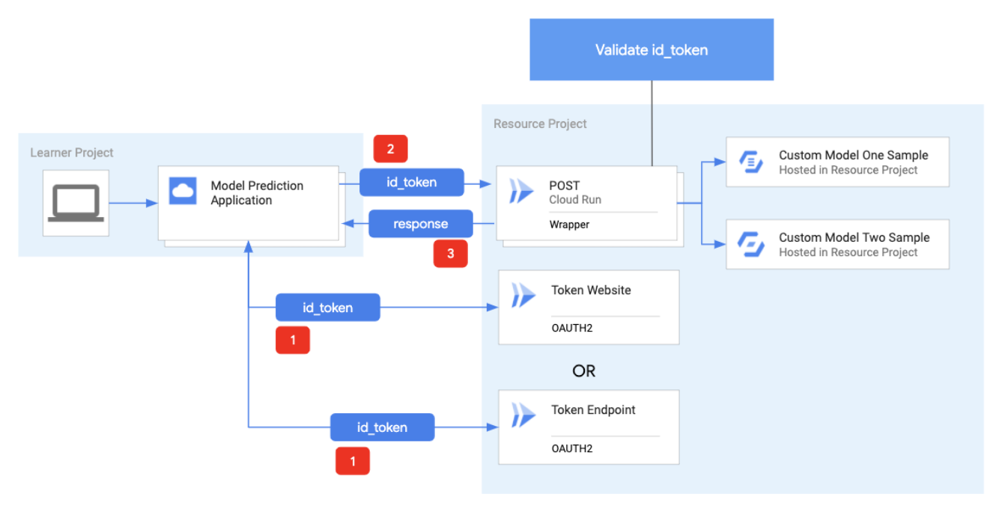
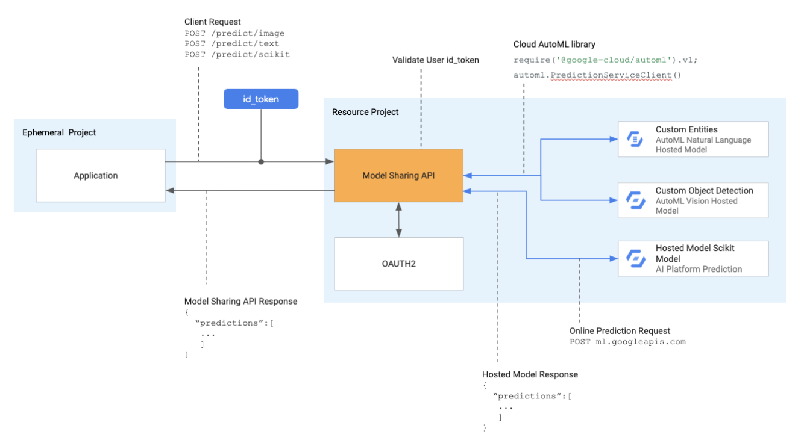

# Shareable Machine Learning API

## Problem
Problem
A major impediment to overcoming the global skills gap in ML/AI is access to compute resources at scale and the energy required to sustain those computations.  The training of ever-more-sophisticated multi-parametric machine learning models can take hours to complete, and with a terrible carbon emissions footprint.  The present teaching methodology of repeated training and re-training of ML/AI models is increasingly infeasible.  Solutions to this problem are needed to broadly enable the training of ML/AI practitioners, especially in low- and middle-income countries.  We have implemented (Figure 1-1) a system allowing learners to access pre-trained models stored in the public cloud and accessible securely and at global scale. 

(Figure 1-1)

## Solution
To provide all learners with access to pre-trained models and not to expose credentials or provide users with direct access to resources we have developed a Model Sharing API and a framework that wraps the elevated access to models within an endpoint (Figure 1-2). The learner would provide their ID_TOKEN to the endpoint which validates with Identity and Access Management (IAM) they have authorization to invoke the framework function. If authorized, the function would run the request on behalf of the user, and response from the hosted model would be the response to the user. This provides learners access to pre-trained models at scale as well as enables the next generation of data scientists.

